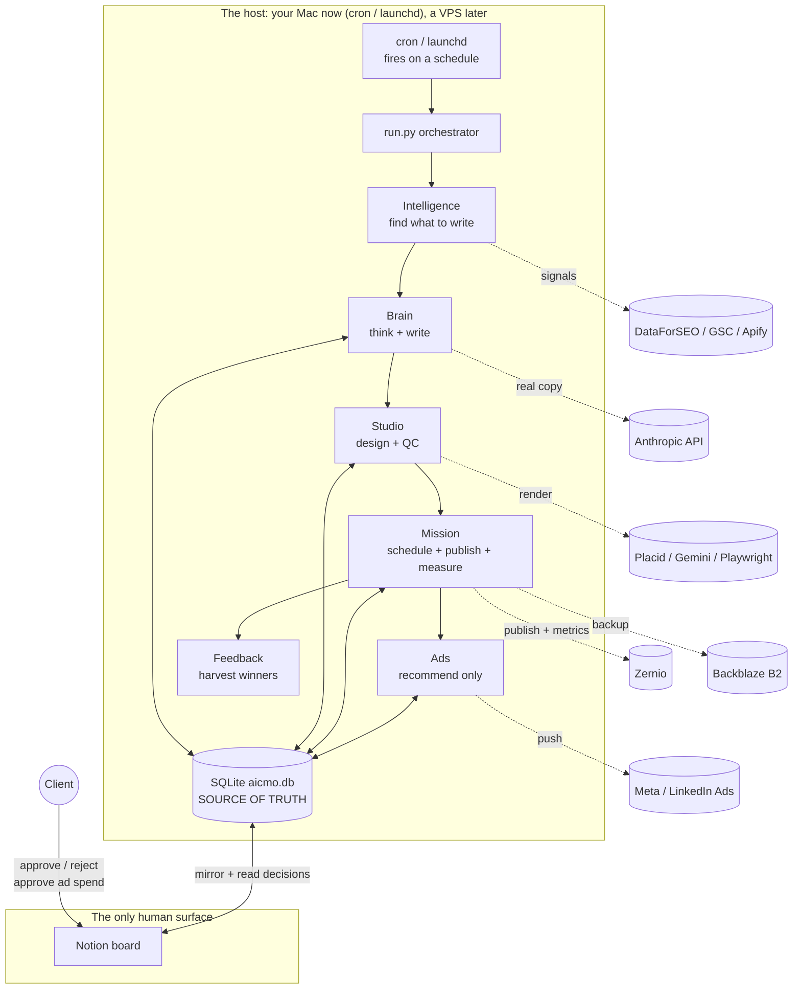
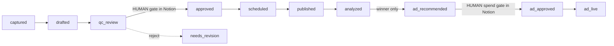

# AI CMO, the whole product

This is the single source of truth for how the AI CMO works as a product. It is
the same product architecture as the sibling repo `aicmo-core`; this repo is the
fuller reference implementation, so more of it is real.

This document adds the layer both repos were missing: the runtime model (how the
thing actually runs unattended) and an honest statement of the one gap that is
still open even here. For component-by-component build status, this doc points to
the existing authoritative docs rather than duplicating them, so there is one
place to maintain each fact.

---

## 1. The product in one sentence

A content marketing department that runs as software. One seed idea goes in, and
the system thinks, writes, designs, quality-checks, waits for one human decision,
then publishes, measures, and recommends paid promotion on the winners.

It runs unattended. The client never opens a terminal and never opens Claude
Code. Claude Code is a build tool, not part of the product. The client's entire
experience is a Notion board.

---

## 2. The runtime model

This is the part the per-station docs leave out, and it is what makes the product
real instead of a demo script.

The agents run as code on a host, on a schedule. Today that host is your own
machine using `cron` or macOS `launchd`, so there is nothing to pay for and the
whole build can be tested end to end including Notion. Later the exact same code
and the exact same cron jobs move to a VPS (Ubuntu) so it stays on when your
laptop sleeps. The host is the only thing that changes. Behavior is identical.

Read it as three layers:

- **The host** runs the agents on a schedule. No human, no Claude Code. SQLite
  (`aicmo.db`) is the source of truth every agent reads and writes.
- **Notion** is the only human surface. The agents mirror the pipeline to it, and
  the client acts on it.
- **External services** are called by the agents on the host. Each is
  credential-gated and falls back to a deterministic offline stub when its key is
  absent, so the loop always runs. In this repo almost all of them are wired (see
  the register linked below).

---

## 3. The agents (the marketing department)

The product works like a marketing department: each role is a persona implemented
by a skill (the craft), a command (the work), and an engine module (the runtime).
The full persona registry, role by role with the exact module that implements
each, is in [`docs/architecture/agents.md`](docs/architecture/agents.md).

The spine is the four stations:

| Station | Folder | Reads to writes | What it does |
|---|---|---|---|
| 1. Brain | `engine/brain/` | `captured` to `drafted` | Turns a seed idea into an on-brand draft via the Brick chain (Intake, Topic, Angle, Hook, Story), grounded in the client's 6-layer context. Fed by the Intelligence layer. |
| 2. Studio | `engine/studio/` | `drafted` to `qc_review` or `needs_revision` | Renders the post to a 1080x1350 graphic (Placid, Gemini, or Playwright) and scores it against the brand spec. |
| 3. Mission | `engine/mission/` | `qc_review` to `approved` to `scheduled` to `published` to `analyzed` | The human approval gate, then schedule, publish (Zernio), verify, and pull analytics. |
| 4. Ads | `engine/ads/` | `analyzed` to `ad_recommended` to `ad_approved` to `ad_live` | Recommends paid promotion on winners only, behind a human spend gate, then pushes to Meta or LinkedIn. |

Plus the front-of-funnel Intelligence layer (seeds), the Feedback layer (learns
from winners), and reporting. All in the persona registry.

---

## 4. The pipeline

One post is one database row walking through statuses. Six transitions run
themselves. Two are human decisions, and both happen in Notion.

---

## 5. Component-level build status

This repo keeps its status in two authoritative places. To avoid two copies of
the same facts drifting apart, this doc points to them rather than restating them:

- **Named-Integration Register** (every external tool, its env seam, and its real
  status in code): [`docs/qa/reference-architecture.md`](docs/qa/reference-architecture.md).
  Almost everything is WIRED here: Placid, Gemini, Playwright, Zernio, Meta Ads,
  LinkedIn Ads, DataForSEO, GSC, Apify, Notion, Backblaze. The one exception is
  Anthropic generation, which is STUB-ONLY (see the gap below).
- **Persona registry** (every role mapped to its skill, command, and engine
  module): [`docs/architecture/agents.md`](docs/architecture/agents.md).
- **Multi-repo and IP boundary**: [`docs/architecture/multi-repo-model.md`](docs/architecture/multi-repo-model.md).

---

## 6. The gap that is still open, even here

This repo is the more thorough of the two, but thoroughness at the station level
hid the same gap `aicmo-core` has. Against the bar of a working prototype (the
whole loop running unattended on a schedule, with real generation, a human
approving in a real Notion board), these are still open:

1. **Brain generation is not autonomous.** The register lists Anthropic as
   STUB-ONLY: `engine/brain/generate.py` runs a deterministic offline stand-in,
   and real copy generation lives in the `/ai-cmo-generate` Claude Code command,
   not in Python. An unattended product on a host cannot call a Claude Code
   command. This needs a Python Anthropic call on the host. It is the single most
   important gap, and it is identical in both repos.
2. **Nothing runs on a schedule.** `run.py` walks the loop when a human invokes
   it, and the per-persona work is driven by `/ai-cmo-*` Claude Code commands.
   There is no cron or launchd job firing the loop unattended.
3. **Notion is a mirror, not yet the live gate.** The Notion client is wired
   (`engine/dashboard/notion_mirror.py`) and the pipeline mirrors to it, but the
   production loop reads its human decisions from the local Flask gate
   (`engine/mission/gate.py`), not back from Notion. For the client to act only in
   Notion, decisions have to be read back from Notion into the pipeline. The
   sibling repo `aicmo-core` has built this read-back (`notion_sync.pull_gate`);
   this repo has not.

Everything else (real render, real publish, real ads push, intelligence, AEO,
reporting, backups) is wired. The gap is the runtime, not the stations.

---

## 7. How core and complete relate

- **`aicmo-core`** is the public engine and the team scaffold. Every station ships
  as a deterministic offline stub so the loop runs end to end with no keys, and
  each builder replaces their stub with a real, credential-gated integration.
- **`aicmo-complete`** (this repo) is the fuller reference implementation. The
  station-level integrations are already wired here, so when a `aicmo-core` row is
  marked "ref: complete," this is where the working version lives.

Both repos share the same product architecture (sections 1 through 4) and two open
gaps: autonomous Brain generation and scheduling. They diverged elsewhere. This
repo went deep on the station integrations (render backends, publishing, ads push,
intelligence, AEO, backups). `aicmo-core` went deep on the Notion human surface and
feedback loop, including the Notion decision read-back this repo still lacks (gap
3), but its Studio render and QC are still stubs. When a component moves status,
update its row in the register and re-run the QA auditor.
